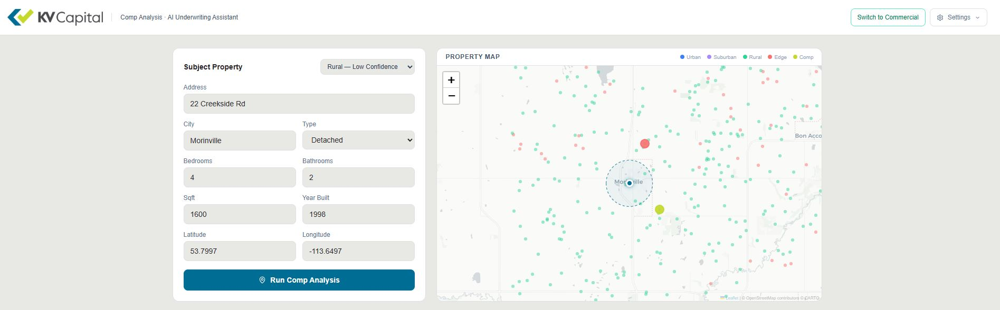
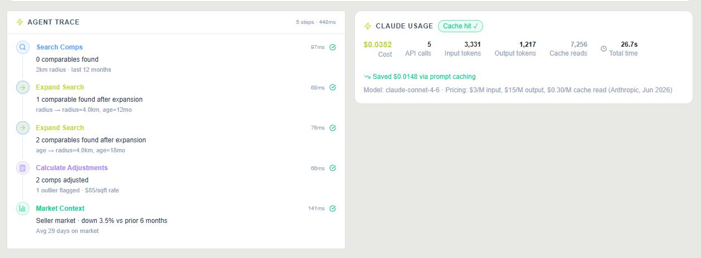
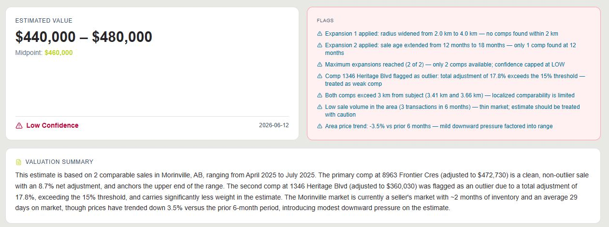
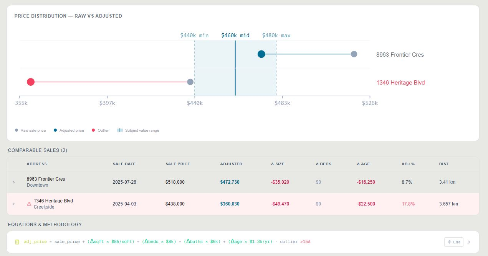
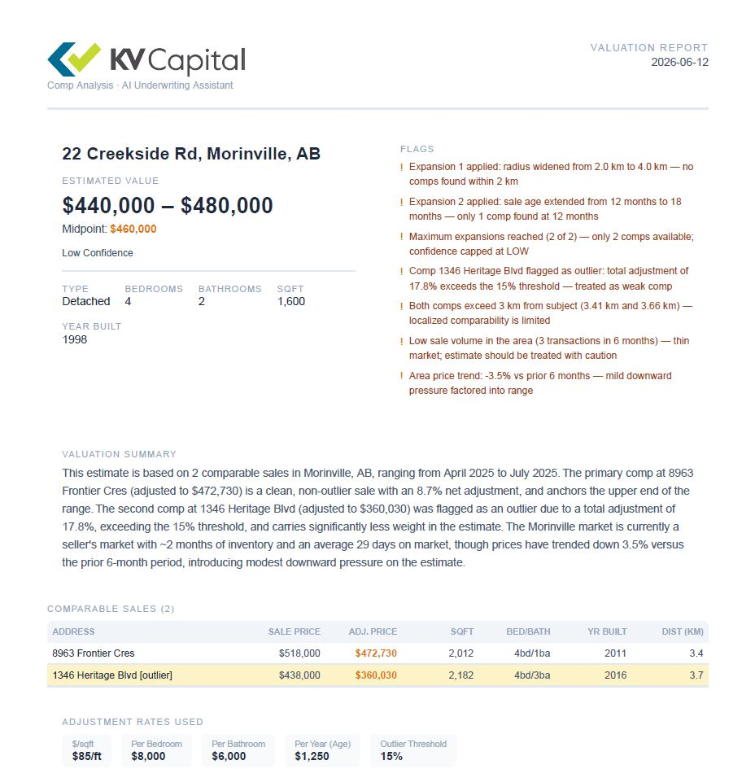
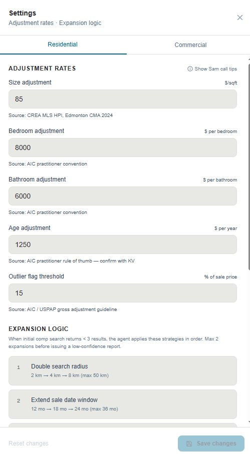
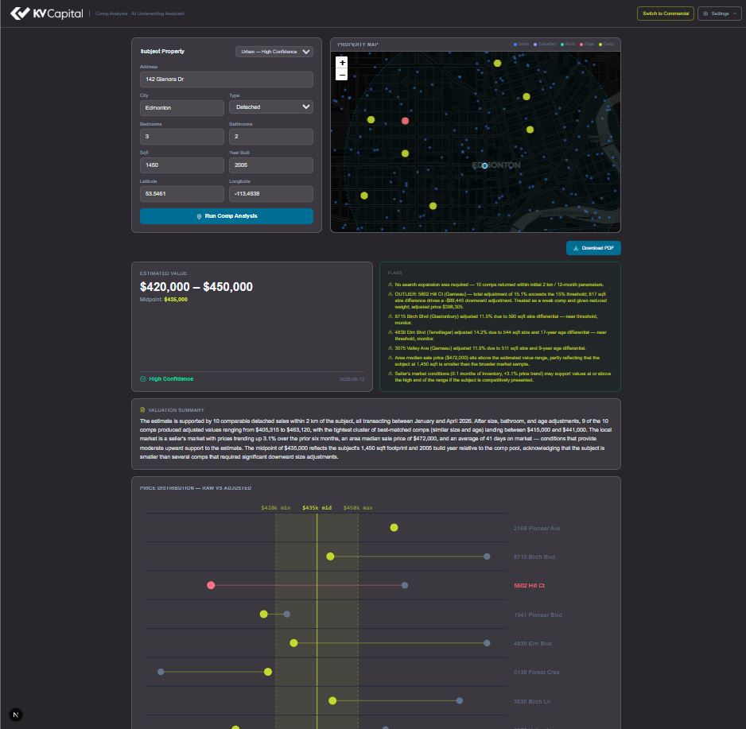

# KV Capital — AI Real Estate Underwriting Tool

**Demo video:** <!-- INSERT LOOM LINK BEFORE SUBMITTING -->  
**Sam call:** Called from [INSERT PHONE NUMBER] <!-- or: "Did not call Sam" -->  
**Submitted:** June 12, 2026

---

## Screenshots

**Subject property form + live map** — property dataset plotted by zone, search radius ring updates as the agent runs



**Agent trace + cost panel** — every tool call visible in real time, with token usage and prompt cache savings



**Estimated value + flags** — value range, confidence level, and a full flag list explaining every decision



**Price distribution chart + comparable sales table** — dumbbell chart shows raw vs adjusted price per comp; outliers highlighted in red; expandable rows show line-item adjustment math



**PDF export** — downloadable valuation report with logo, subject details, flags, narrative, comp table, and adjustment rates



**Settings drawer** — all adjustment rates configurable with sources cited; expansion logic documented



**Dark mode**



---

## What It Does

Given a subject property, the agent:
1. Retrieves comparable sales by distance and property similarity
2. Calculates dollar-value adjustments per comp (size, bedrooms, bathrooms, age) following AIC CUSPAP guidelines
3. Ranks and filters comps — flagging outliers where gross adjustments exceed 15% of sale price
4. Reconciles the comp pool into an estimated value range with a confidence level
5. Explains every step in real time via a visible agent trace (tool calls, inputs, outputs, reasoning)

For commercial (income-producing) properties, the agent also runs a Direct Capitalization income approach and reconciles it with the sales comparison result.

---

## Quick Start

### Prerequisites
- PostgreSQL 15+ with pgvector extension
- Python 3.11+
- Node.js 20+
- Anthropic API key

### Backend
```bash
cd backend
python -m venv venv
venv\Scripts\activate          # Windows
# source venv/bin/activate     # Mac/Linux

pip install -r requirements.txt

cp .env.example .env           # fill in DATABASE_URL and ANTHROPIC_API_KEY

psql $DATABASE_URL -f db/schema.sql
python data/generate_dataset.py                    # residential: ~500 records
python data/generate_commercial_dataset.py --clear # commercial: 200 records
python db/seed.py                                  # loads data into Postgres

python -m uvicorn app.main:app --reload --port 8000
```

### Frontend
```bash
cd frontend
npm install
npm run dev   # http://localhost:3000
```

---

## Architecture

### Residential
- **Agent**: Claude claude-sonnet-4-6 with 5 tools — `search_comps`, `expand_search`, `calculate_adjustments`, `get_market_context`, `generate_report`
- **Methodology**: AIC CUSPAP Sales Comparison Approach — direct comparison with dollar-value adjustments for size, bedrooms, bathrooms, age
- **Search**: Haversine distance filter → pgvector embedding re-rank on property descriptions (OpenAI text-embedding-3-small when key is present; cosine similarity fallback on synthetic features otherwise)
- **Streaming**: Server-Sent Events — agent trace visible in real time, each tool call and its output rendered as it arrives
- **Visualization**: Dumbbell chart (raw vs adjusted price per comp), Mapbox map view, expandable comp table with line-item math per comp, PDF export

### Commercial
- **Agent**: Claude claude-opus-4-8 with 5 tools — `search_commercial_comps`, `expand_commercial_search`, `calculate_commercial_adjustments`, `calculate_income_value`, `get_market_context`
- **Methodology**: CUSPAP — Income Approach (Direct Capitalization) primary, Sales Comparison secondary, reconciled by weighted average (default 65% / 35%)
- **Cap rate benchmarks**: Altus Group Canadian Cap Rate Report Q4 2024 — seeded in `market_benchmarks` table, cited in UI, reports, and chart annotations
- **Two paths**: NOI provided → income approach + sales comparison → reconciled. No NOI → sales comparison only + flag
- **Asset classes**: Industrial, Office (Class A/B/C), Multifamily
- **Sensitivity table**: 5 rows at selected cap rate ±25bps, ±50bps
- **Cap Rate Scatter chart**: X = GBA sqft, Y = implied cap rate. Altus benchmark range drawn as a band. Green dots = in lane, amber = outside lane, red = statistical outlier. Subject marked with vertical line at selected rate.

---

## Approach and Methodology

### Why Sales Comparison Approach
CUSPAP is explicit: Sales Comparison is the primary approach for residential. The challenge is that "comp analysis" in practice is a judgment problem, not a math problem — a good appraiser doesn't average comps, they reason about which comps are informative and which introduce noise. The agent mirrors this by:

1. Searching a tight radius first, expanding only if the comp pool is thin (mirrors appraiser practice)
2. Calculating gross adjustments per comp and flagging anything above 15% (AIC guideline) as a weak comparable
3. Deriving a value range from the IQR of adjusted non-outlier comps — not a simple mean, which can be pulled by a single outlier
4. Producing a narrative that names the specific comps that drove the conclusion

### Why the Agent Trace Is Visible
The target user is a commercial underwriter making a lending decision. They can't put a black-box number in a credit memo — they need to be able to explain every step to a credit committee. The agent trace renders every tool call, its inputs, its outputs, and the agent's stated reasoning in real time. This is not a UX nicety; it's the feature that makes the output auditable.

### Comp Scoring Logic
Comps are ranked by a composite of: (1) distance (primary filter — haversine, configurable radius), (2) embedding similarity (pgvector cosine distance on property descriptions), (3) implied adjustment magnitude (smaller adjustment = higher weight in reconciliation). Statistical outliers (IQR method on adjusted prices) are kept in the UI for transparency but excluded from the value range calculation.

### Commercial: Two Approaches, Reconciled
With commercial property, price per square foot doesn't carry the analysis — what matters is what the building earns. The agent runs two approaches and combines them.

**Income Approach (Direct Capitalization):** We take the net operating income — rent collected after expenses — and divide it by a market cap rate. The cap rate is what investors in this market accept as a return on this type of asset. We benchmark that against the Altus Group Canadian Cap Rate Report Q4 2024 for that asset class and city. The agent selects a rate within the benchmark range, weighted toward the comp cluster's central tendency. Value = net operating income / selected cap rate.

**Sales Comparison:** Same adjustment logic as residential — size, age, building class — applied to the commercial comp pool.

**Reconciliation:** The two values are combined, weighting the income side heavier for stabilized assets with clean income data. Both weights are configurable.

**Outlier detection:** Comps with implied return rates outside the Altus benchmark range are flagged in the scatter chart and the comp table. Distressed sales, related-party transactions, and vacant-at-sale buildings commonly produce anomalous return rates — flagging them prevents a single bad comp from skewing the selected rate.

**Sensitivity table:** Five rows showing how the value moves if the return rate assumption shifts up or down. A lender needs to understand the range of outcomes, not just the point estimate.

---

## Tradeoffs

### What I cut and why

**Machine learning ranking model** → Used embedding similarity + adjustment magnitude instead. A learned ranking model would require labelled training data (appraiser-validated comp sets) that doesn't exist in synthetic form. Embedding similarity on property descriptions captures the same intuition with less complexity and is explainable to a non-ML audience.

**Full CUSPAP adjustment grid** → Implemented size, bedrooms, bathrooms, age. Location, condition, and garage adjustments were scoped out. Location adjustment requires sub-market boundary data I didn't have; condition is unobservable from MLS records without description parsing. These are flagged in the agent's reasoning when comps diverge but not quantified — which is honest (a made-up location adjustment is worse than acknowledging the gap).

**DCF / multi-year projections** → Direct Cap only for commercial. DCF requires lease-level data (WALT, rent escalation clauses, renewal options) that can't be reliably synthesized. Direct Cap is the standard for stabilized income-producing properties and the right default for the comp analysis problem as stated.

**Retail and special-purpose commercial** → Industrial, Office, Multifamily only. Retail requires tenant covenant scoring and co-tenancy analysis. Special-purpose (cold storage, medical office) requires asset-specific adjustment factors. These are documented as next steps — scoping to the three highest-volume asset classes for a $900M AUM lender covers the majority of deals.

**Authentication / multi-user** → Single-user demo. The problem is comp analysis, not user management. Adding auth would have consumed 4–6 hours with zero rubric value.

**Map view for commercial** → Residential map is implemented; commercial map deferred. The scatter chart is more informative for commercial (cap rate tells you more than a pin on a map) and was higher value per hour.

### What I'd do differently with more time

- Wire real MLS/REALPAC data via a restricted API rather than synthetic records — the methodology holds, but real data would let a judge run an address they recognize
- Add a confidence model that distinguishes between thin comp pool (data gap) and high-variance comps (genuine market uncertainty) — currently both report as "low confidence"
- Commercial PDF export — residential PDF is production-quality; commercial PDF is deferred

---

## Data

### Residential
- ~500 synthetic property sales across Edmonton / Calgary
- Zones: urban_dense, suburban_sparse, rural, edge_case
- Calibrated to CREA MLS HPI 2024 price ranges
- Edge cases hardcoded: zero comps (Radway), large outlier (Stony Plain), high variance (Fort Saskatchewan)

### Commercial
- 200 synthetic income-producing property sales
  - 80 industrial (Edmonton/Calgary, NNN leases, GBA 5k–80k sqft)
  - 70 office (Class A/B/C, Edmonton/Calgary, 2k–40k NRA sqft)
  - 50 multifamily (12–80 units, Edmonton/Calgary)
- Income consistency enforced: NOI = EGI × (1 − expense_ratio), implied_cap_rate = NOI / sale_price
- Calibrated to Altus Group Q4 2024 cap rate benchmarks

---

## Key Sources

| Source | Use |
|--------|-----|
| **AIC — CUSPAP** | Methodology for residential (Sales Comparison) and commercial (Income Approach + Sales Comparison) |
| **Altus Group Canadian Cap Rate Report Q4 2024** | Cap rate benchmarks by asset class, building class, and city |
| **CREA MLS HPI, Edmonton CMA 2024** | Residential $/sqft adjustment calibration |
| **CMHC Rental Market Report Fall 2024** | Multifamily vacancy and rent range calibration |

---

## Settings

All core parameters are configurable via the Settings panel in the UI:
- Adjustment threshold for outlier flag (default: 15% residential / 25% commercial — AIC guideline)
- Search radius defaults
- Income/sales reconciliation weights (default: 65/35)
- Number of comps retrieved

---

## Commercial — Next Steps (Production Path)

### Valuation methodology
- **DCF**: Multi-year projection with terminal cap rate, rent escalation, vacancy ramp-up — required for value-add acquisitions
- **Cost Approach**: Land value + depreciated replacement cost — required for special-purpose properties
- **GRM cross-check**: Quick gross rent multiplier sanity check for multifamily

### Asset class expansion
- **Retail / Mixed-Use**: Tenant covenant scoring, anchor tenant weighting, co-tenancy adjustment
- **Special Purpose**: Industrial cold storage, self-storage, medical office — asset-specific adjustment factors

### Income data enrichment
- **Lease abstract ingestion**: Parse lease PDFs to extract in-place rents, expiry dates, escalation clauses
- **WALT sensitivity**: Adjust cap rate by Weighted Average Lease Term — short WALT = higher cap rate
- **Vacancy curve modeling**: Market vacancy ramp-up for partially-leased properties

### Infrastructure
- **Quarterly benchmark refresh**: `market_benchmarks` table structured for quarterly Altus updates
- **OpenAI embeddings**: Commercial dataset uses zero-vector stub embeddings (no key set). With a key, description similarity re-ranking activates.
- **Audit log**: Valuation history per address — useful for deal pipeline tracking
